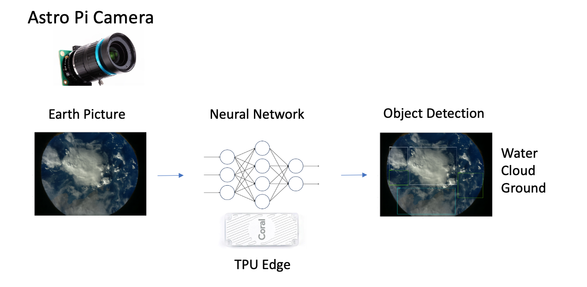

# BlueLens Astro Pi project

Water is fundamental for life sustainability and development on Earth and others planets.
Aware of how important this resource is, the Bergson Highschool team will build an experiment to evaluate Earth surface covered by water: 72%. To do so, we are going to leverage the new Astro Pi ML capabilities by building an object detector customised for water area detection: ocean, seas, lake, glacier and river. By taking high frequence picture of Earth from ISS (more than 1000) with the Coral TPU accelerator, we are going to build an estimator of water surface average as well as the dispersion around this value.



# Bluelens Astro Pi experiment
The Bluelens experiment designed by the Bergson Highschool team is available [here](src/main.py).
Be aware that this code can only be successfully run on Astro Pi Hardware which is a Raspberry Pi 4B model with Coral TPU Edge accelerator and a Pi Camera, as well as Astro Pi prepared Operating System.
To run the Bluelens experiment you can execute the following script from within Astro Pi HW:
```shell
python3 main.py
```
The experiment will take photo from the camera and detect whether it contains Water, Cloud or Ground areas using Deep Learning Object Detection technology.

# Pre-Requesite

## Pre-requesite for TFLite Object Detection model_maker
You need to install tflite-model-maker package which is the library used to build the final object detection model able to run on TPU edge with boosted performance.
```shell
pip install -q tflite-model-maker
```

## Pre-requesite for Tensorflow Object Detection API

You need to build a python environment (conda or virtual env) with specific version of tensorflow (2.6 or 2.7) to be able to run the tensorflow object detection code.
However, the final object detection model has been built using tflite_model_maker library, not the tensoflow library. Therefore, you could skip the pre-requesite below of having tensorflow object detection API working (which might be cumbersome).

```shell
python -m pip install --upgrade pip==20.0.2
```
```shell
git clone --depth 1 https://github.com/tensorflow/models
```
```shell
pip install -r requirements.txt
```
```shell
cd models/research/ && protoc object_detection/protos/*.proto --python_out=.
cd models/research/ && cp object_detection/packages/tf2/setup.py .
cd models/research/ && python -m pip install .
```
Again this part can be skipped if you want to go directly to building TFlite model ready for TPU edge on Raspberry Pi.

# Training

## TFLite EfficientDet model
To train an EfficientDet model you can run this [notebook](training/bluelens_TFlite_efficientDet_edge_tpu.ipynb) for a step by step approach. 
This is adapted from this [colab notebook](https://colab.research.google.com/github/google-coral/tutorials/blob/master/retrain_efficientdet_model_maker_tf2.ipynb).\
You can also simply execute the training [script](training/bluelens_TFlite_efficientDet_training.py):
```shell
python bluelens_TFlite_efficientDet_training.py
```

## TF SSD_Mobilenet model
To train an SSD_Mobilenet model you can run this [notebook](training/bluelens_TF2_few_shot_training.ipynb) for a step by step approach. This is adapted from this [colab notebook](https://github.com/tensorflow/models/blob/master/research/object_detection/colab_tutorials/eager_few_shot_od_training_tflite.ipynb).\
You can also simply execute the training [script](training/bluelens_TF2_few_shot_training.py):
```shell
python bluelens_TF2_few_shot_training.py
```

# Inference
Make sure you created with training notebooks a TFLite EfficientDet model or TF SSD_Mobilenet model before you can run inference. All inference notebooks and scripts rely on a previously trained model. Model (savedModel,tflite) are made at end of training notebooks under Export section. This export process is not part of training scripts.

## TFLite EfficientDet model
To test the EfficientDet model you can run this [notebook](inference/bluelens_TFlite_inference_edge_tpu.ipynb) for a step by step approach. 
This is adapted from this [colab notebook](https://colab.research.google.com/github/google-coral/tutorials/blob/master/retrain_efficientdet_model_maker_tf2.ipynb).
You can also simply execute the inference [script](inference/bluelens_TFLite_few_shot_inference.py):
```shell
python bluelens_TFlite_inference.py --image-name zz_astropi_1_photo_189
```
## TF SSD_Mobilenet model
To test the SSD_Mobilenet model you can run this [notebook](inference/bluelens_TF2_few_shot_inference.ipynb) for a step by step approach. This is adapted from this [colab notebook](https://github.com/tensorflow/models/blob/master/research/object_detection/colab_tutorials/eager_few_shot_od_training_tflite.ipynb).
You can also simply execute the inference [script](training/bluelens_TF2_few_shot_training.py):
```shell
python bluelens_TF2_few_shot_training.py --image-name zz_astropi_1_photo_189
```


